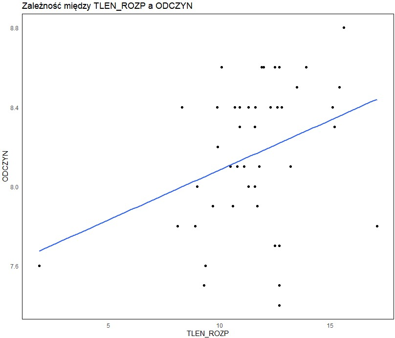
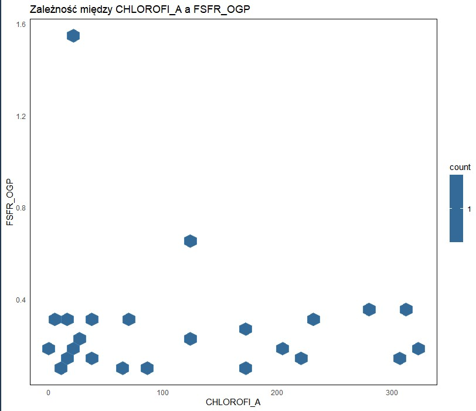
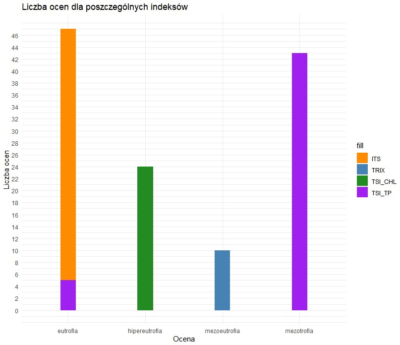

# Eutrophication Data Analysis 

Academic project focused on analyzing **eutrophication** and various statistical indices, including TSI (Trophic State Index), ITS, and TRIX in aquatic ecosystems using **R**. The dataset (BUG.xls) contains water quality parameters

##  Features  
- Data preprocessing and transformation
- Calculation of eutrophication indices (**TSI, ITS, TRIX**)  
- Visualization of results using **ggplot2**  
- Statistical analysis of water quality parameters  

##  Technologies  
- **R** (tidyverse, ggplot2, tidyr, rMR, readxl)

## Plots 

Relationship between oxygen dissolution (tlen_rozp) and pH (odczyn)




Relationship between  Chlorophyll (chlorofil_a) and Phosphorus Organic Geochemical Proxy (FSFR_OGP)



Number of Ratings for Different Indices




##  How to Use  
1. Clone the repository:  
   ```bash
   git clone https://github.com/kuba99i1/eutrophication-r-analysis.git

2. Open projekt_eutro.R in RStudio or any other R environment.

3. Ensure BUG.xls is in the project directory.

4. Run the script to analyze the dataset and generate results.
   
